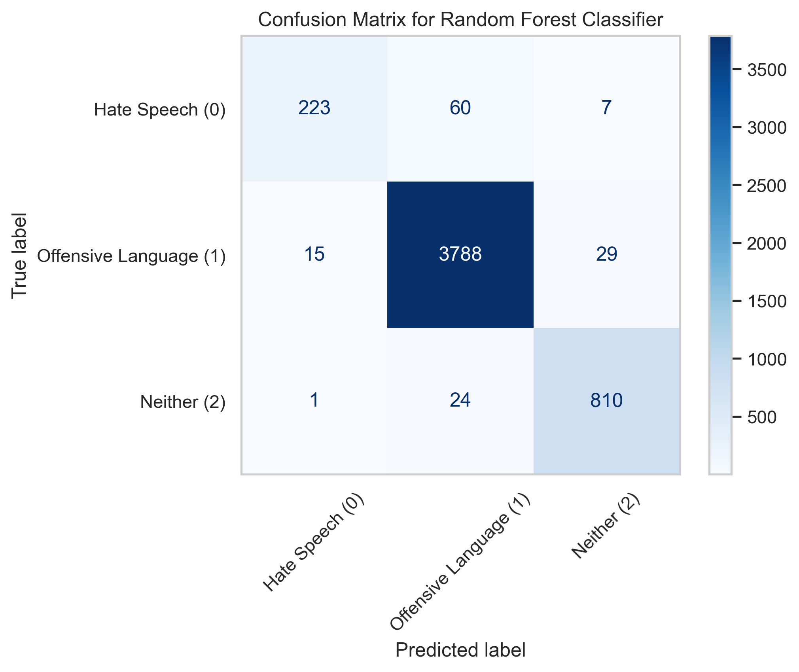

# 🛡️ Hate Speech Detection on Social Media using NLP + Machine Learning

This project detects **Hate Speech**, **Offensive Language**, and **Neutral content** in tweets using Natural Language Processing and Machine Learning. It is built as a **Capstone Project** during a Data Science internship, with a focus on model interpretability, reproducibility, and presentation-ready insights.

---

## 📌 Problem Statement

Social media platforms like Twitter are often plagued by hate speech and offensive language. Manual moderation is infeasible at scale. This project aims to build a **Machine Learning Model** that can automatically classify tweets into:

- **0 → Hate Speech**
- **1 → Offensive Language**
- **2 → Neither (Neutral)**

---

## 🎯 Objectives

- Perform exploratory data analysis (EDA)
- Clean and preprocess tweet text
- Vectorize text using TF-IDF
- Train ML models (Random Forest, etc.)
- Evaluate and visualize model performance
- Package the pipeline for reproducibility

---

## 🧠 Tech Stack

| Task            | Tools Used                                               |
|-----------------|----------------------------------------------------------|
| Language        | Python                                                   |
| Notebooks       | Jupyter                                                  |
| Libraries       | Pandas, NumPy, Matplotlib, Seaborn, Scikit-learn, Joblib |
| Model           | Random Forest Classifier                                 |
| Vectorization   | TF-IDF                                                   |
| Environment     | VSCode / Jupyter Notebook                                |
| Version Control | Git & GitHub                                             |

---

### 📁 Project Structure

```
Hate-Speech-Detection/
├── data/
│   ├── hate_speech.csv              # Original raw dataset
│   ├── cleaned_data.csv             # Cleaned version of dataset
│   ├── tfidf_vectorizer.pkl         # Saved TF-IDF vectorizer
│   └── best_model_rf.pkl            # Trained Random Forest model
│
├── notebook/
│   ├── 01_EDA.ipynb                 # Exploratory Data Analysis
│   ├── 02_Text_Preprocessing.ipynb  # Cleaning and preparing text
│   ├── 03_Vectorization.ipynb       # TF-IDF vectorization
│   ├── 04_Model_Training.ipynb      # Model training and testing
│   └── 05_Evaluation_Visualization.ipynb  # Performance & visualization
│
├── images/
│   └── plots/                       # Model performance visualizations
│
├── scripts/
│   |── hate_speech_pipeline.py     # Complete pipeline script
|   └── model_predictor.py          # Model Predictor script
│
├── README.md                        # Project documentation
└── requirements.txt                 # Environment dependencies
```


---

## 🧪 Dataset Info

📂 Source: Kaggle – Hate Speech and Offensive Language Dataset
📊 Shape: ~25,000 tweets
🏷️ Label Mapping:

0: Hate Speech
1: Offensive Language
2: Neutral (Neither)

---

## 📊 Model Performance (Random Forest)

1. Accuracy: ~89.7%
2. F1-Score (weighted): ~88%
3. Best Performing Model: Random Forest Classifier

Confusion Matrix: 

```
               Predicted
              0    1    2
           ----------------
Actual  0 | 223   59    8
        1 |  17 3782   33
        2 |   1   19  815
```

### Confusion Matrix (Random Forest)



## 💡 Conclusion

This project demonstrates an end-to-end pipeline for detecting hate speech using text classification. With robust accuracy and clear visualizations, the model can assist in automated moderation of harmful online content, particularly for platforms like Twitter.

The pipeline is modular and reproducible, making it suitable for future integration into real-world applications.


## 👨‍💻 Author

Ratul Mukherjee, 
Data Science Intern, 
📍 Kolkata, India, 
🔗 GitHub (https://github.com/ratulmukherjee06) | LinkedIn (https://www.linkedin.com/in/ratulmukherjee06/)